# システム図・フロー図

このドキュメントでは、Clash Royale Analytics Platformのシステム全体を理解するための各種図を提供します。

## 📊 システムアーキテクチャ図

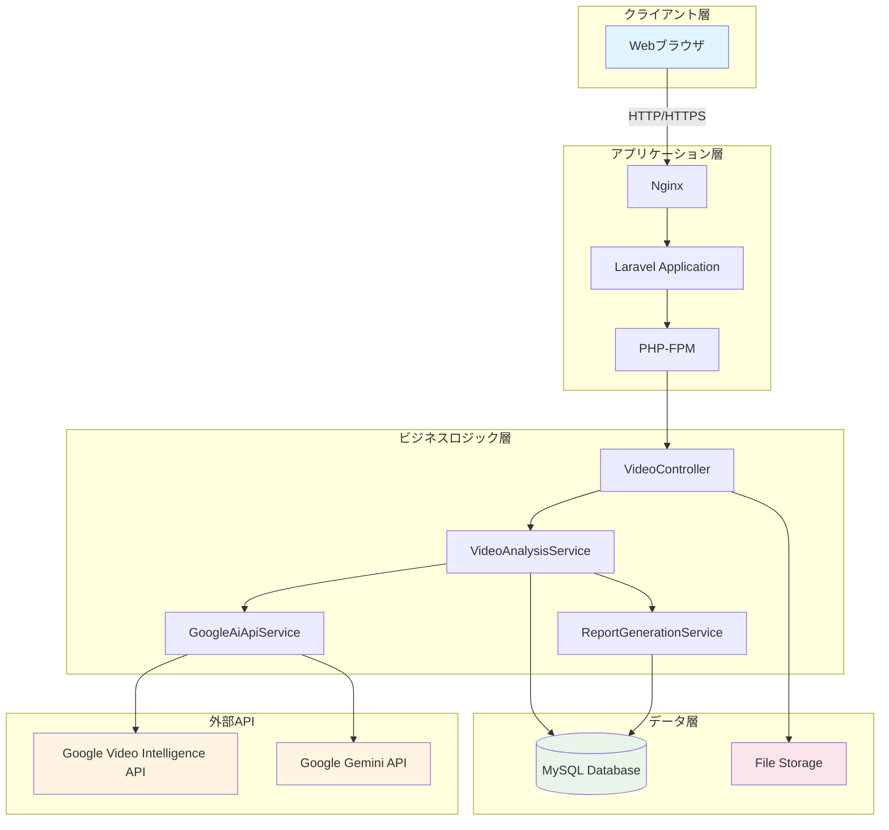

## 🔄 動画アップロードフロー

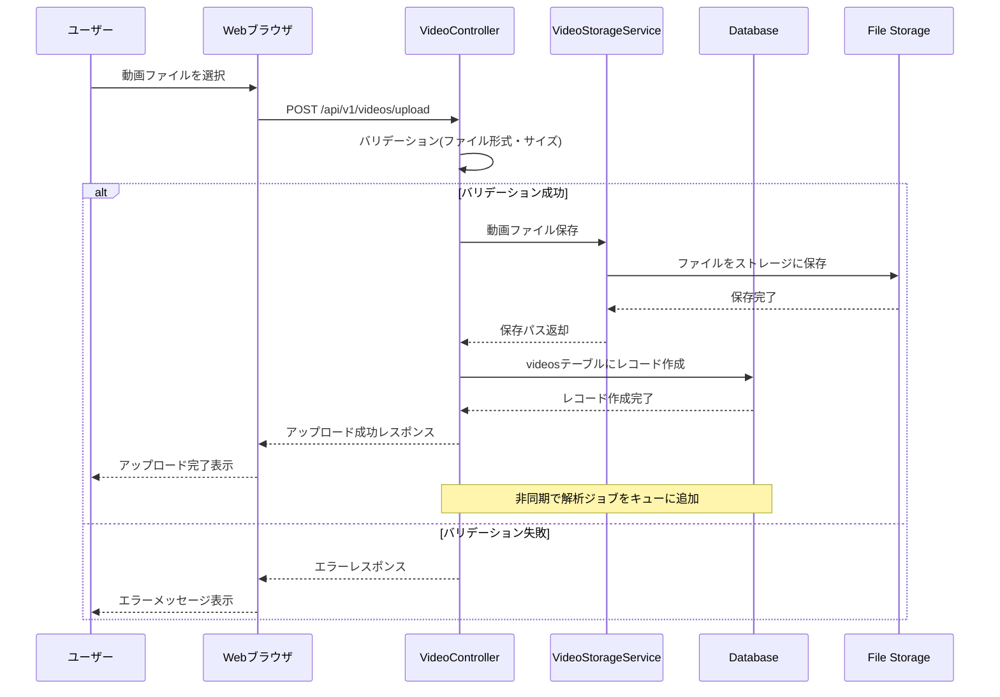

## 🤖 動画解析フロー

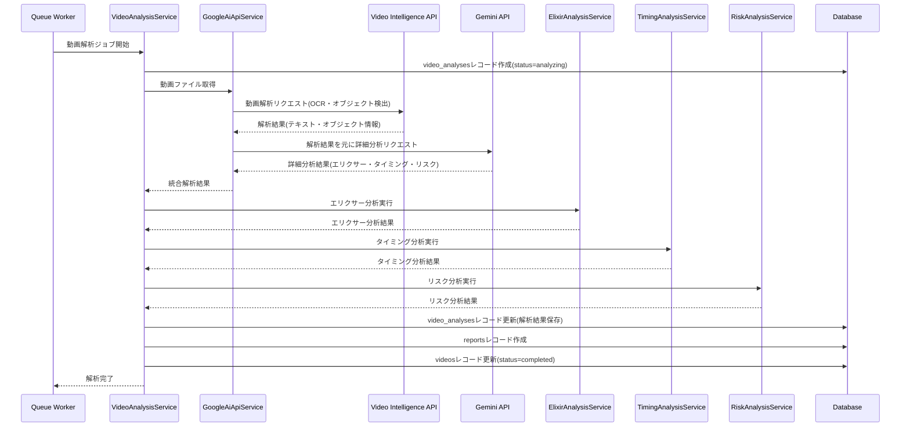

## 📈 レポート生成・表示フロー

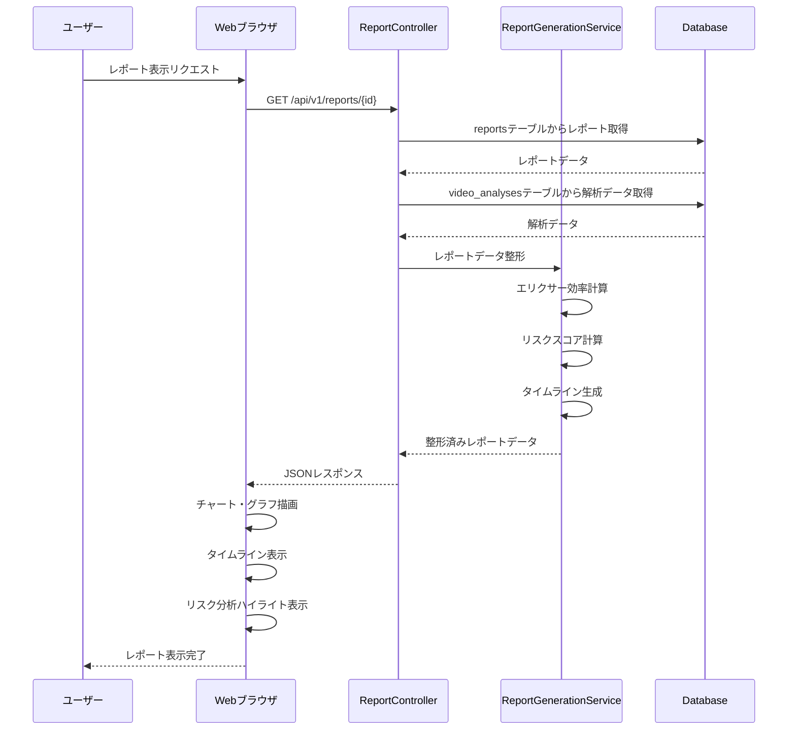

## 🗄️ データベースER図 (詳細版)

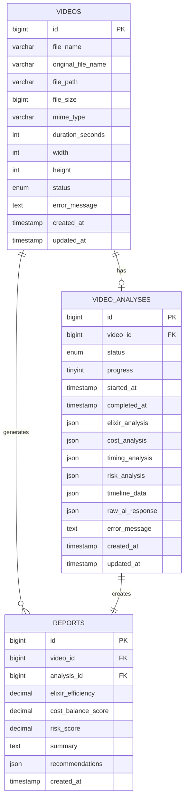

## 🔀 データフロー図

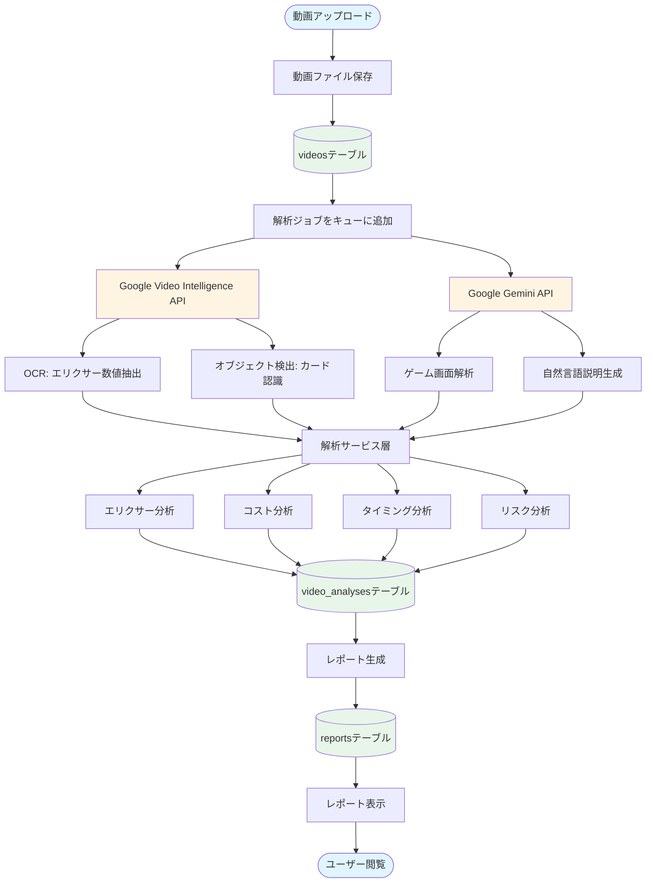

## ⚙️ コンポーネント構成図

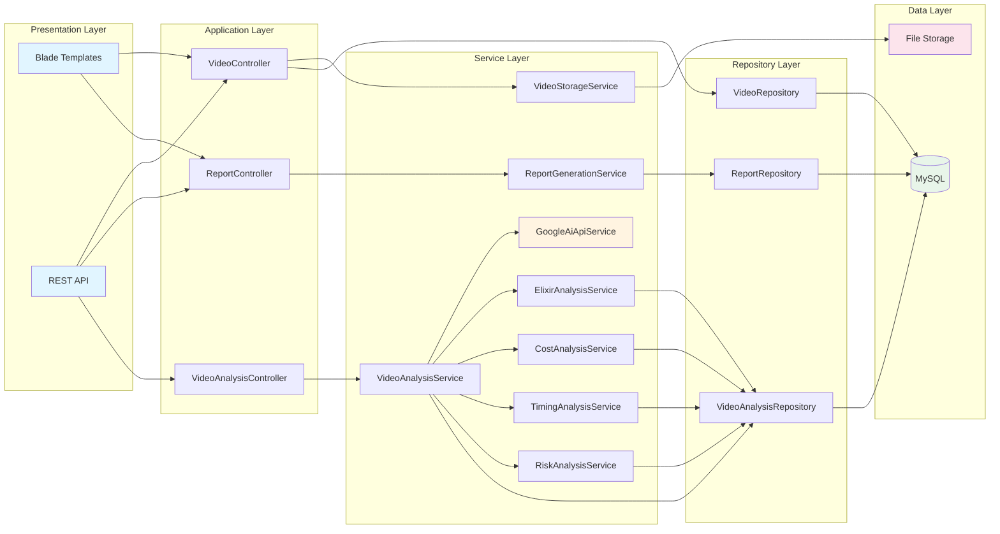

## 🔐 認証・認可フロー

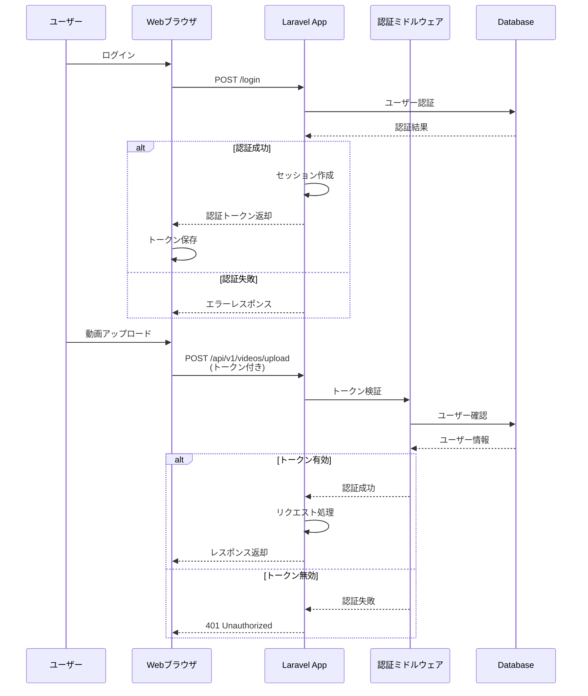

## 📊 エリクサー分析プロセス詳細

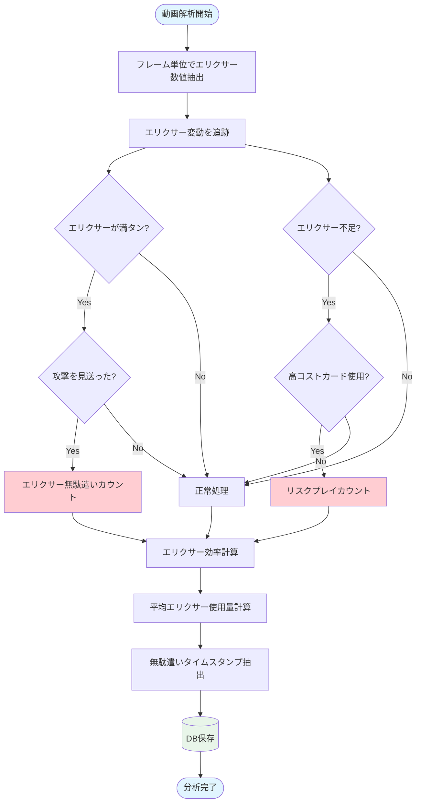

## 🎯 リスク分析プロセス詳細

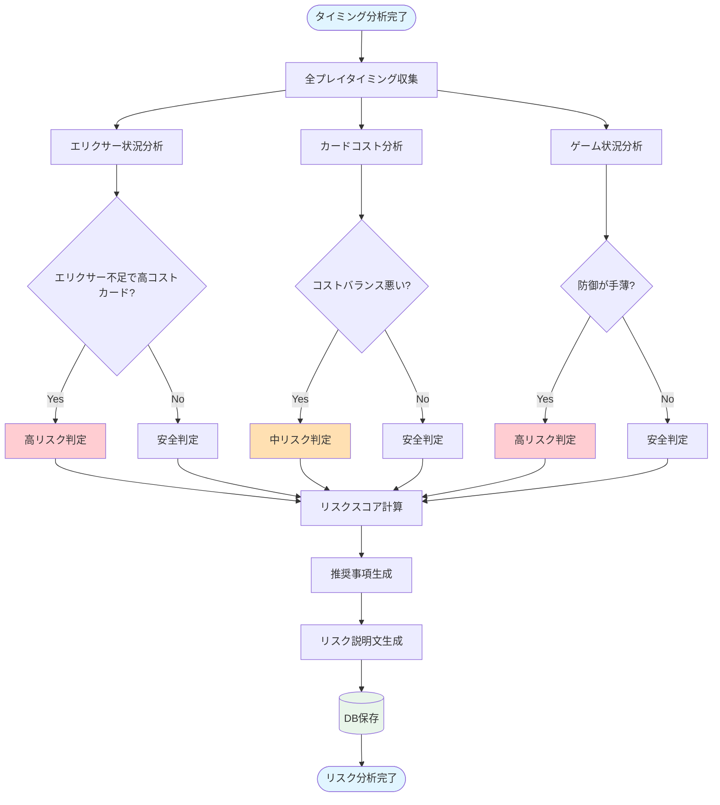

## 🚀 システム全体フロー (統合図)

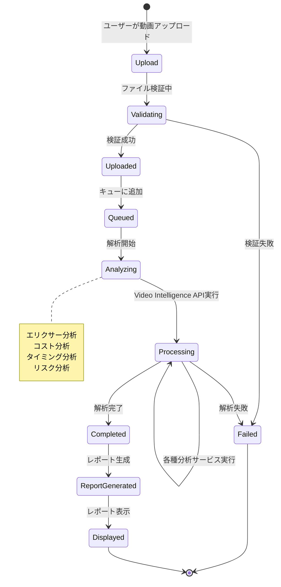

---

**最終更新**: 2026-01-06
